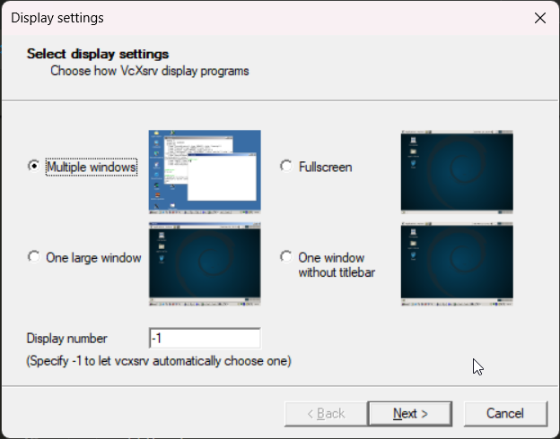
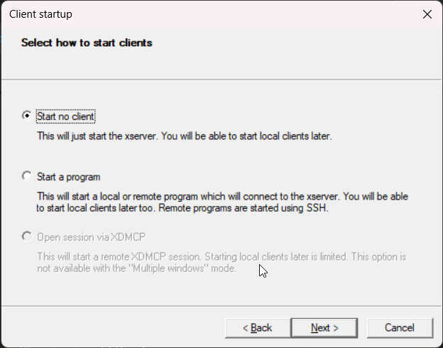
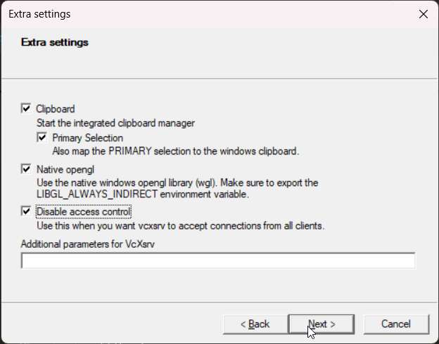

# Automatic Number Plate Recognition (ANPR) Project using Docker

This is my Bachelors degree project. It implements YOLOv8 and a CNN-based custom OCR model to perform Automatic Number Plate Detection (ANPR) on Indian four-wheelers.

The system is optimized to perform OCR on 2-Row Indian High Security Registration Plates (HSRNs).

The model detects 1-Row HSRNs (from Bikes) but does not perform OCR correctly.

It doesn't detect Indian Green HSRNs (for EVs) at all.

---

## Key Features

1. License plate detection is handled through YOLOv8, and the model is trained in Google Colab.
2. OCR is integrated directly within the license plate detection pipeline, making it seamless and efficient.
3. Complete containerized solution using Docker for easy setup and deployment.

---

## Running the Project using Docker

Follow the steps below to build and run the project using Docker. This setup eliminates the need to configure different environments manually, as everything is containerized and optimized for WSL.

---

### Requirements

- **WSL:** Ubuntu 24.04 LTS
- **Docker:** Install Docker and set it up on your Windows and shares with WSL system.
- **NVIDIA GPU Support (Optional):** Ensure Docker supports your GPU configuration and CUDA version.
- **VcXsrv (For GUI support):** Required to visualize outputs.

---

### Step 1: Prepare Docker Environment

1. Ensure you have Docker installed and running in WSL.

2. Use the pre-configured `Dockerfile` to create the container:

    ```dockerfile
    FROM nvcr.io/nvidia/tensorflow:24.05-tf2-py3
    
    # Install dependencies for GUI support
    RUN apt-get update && apt-get install -y --no-install-recommends \
      libgl1-mesa-glx \
      libglib2.0-0 \
      x11-apps && \
      rm -rf /var/lib/apt/lists/*
    
    # Install PyTorch with CUDA 12.4 support
    RUN pip install torch==2.6.0 torchvision==0.21.0 torchaudio==2.6.0 --index-url https://download.pytorch.org/whl/cu124
    
    # Install additional Python packages
    RUN pip install --no-cache-dir imutils deskew ultralytics
    ```

3. Build the Docker image:

    ```bash
    docker build -t anpr_ml .
    ```

4. Set up VcXsrv for GUI support:
    - Install VcXsrv: [Download it here](https://sourceforge.net/projects/vcxsrv/).

    - Launch the 'XLaunch' application with these settings:
      1. Multiple windows.
      
         
      
      2. Start no client.
      
         
      
      3. Disable access control.
      
         

5. Allow TCP connections on port 6000 in your Windows firewall.

6. Open WSL & Setup x11 apps:

    ```
    sudo apt install x11-apps 
    ```

7. Then Set the display variable in shell:

    ```bash
    echo "export DISPLAY=$(ip route list default | awk '{print $3}'):0" >> ~/.bashrc
    echo "export LIBGL_ALWAYS_INDIRECT=1" >> ~/.bashrc
    source ~/.bashrc
    ```


---

### Step 2: Running the Project Container

1. Define your project folder location in a variable for easier reference:

    ```bash
    PROJECT=/path/to/your/project
    ```

2. Launch the Docker container with an optimized and simplified command:

    ```bash
    docker run --gpus all --ipc=host --ulimit memlock=-1 --ulimit stack=67108864 \ --env DISPLAY=$DISPLAY \ --env YOLO_CONFIG_DIR=/app/ANPR/config \
         --volume /tmp/.X11-unix:/tmp/.X11-unix \
         -v $PROJECT:/app/ANPR \
         -it --rm anpr_ml
    ```

3. Inside the container, navigate to the project directory:

    ```bash
    cd /app/ANPR
    ```

4. Run the full detection and OCR pipeline:

    ```bash
    python main_detection.py
    ```

5. The results, including detected license plate numbers and processed images, will be saved in the `Results/` directory.

---

### Using Video Detection

To process videos, check the `Video_Detection/` folder in the data->old_code directory. You can download sample video files [here](https://mega.nz/folder/yYNATSab#_joN65RZaTYx8PvoovLZlQ). Make sure to mount the appropriate data directories within the Docker container.

Run the corresponding detection script for videos within the container.

---

### Additional Notes

1. Ensure VcXsrv is running and properly configured before launching the Docker container.
2. To use Nvidia GPU with Docker, ensure you have the Nvidia container toolkit installed and ready.

With this Docker-based setup, the entire installation and runtime dependencies are managed for you, ensuring stability and reproducibility across environments.